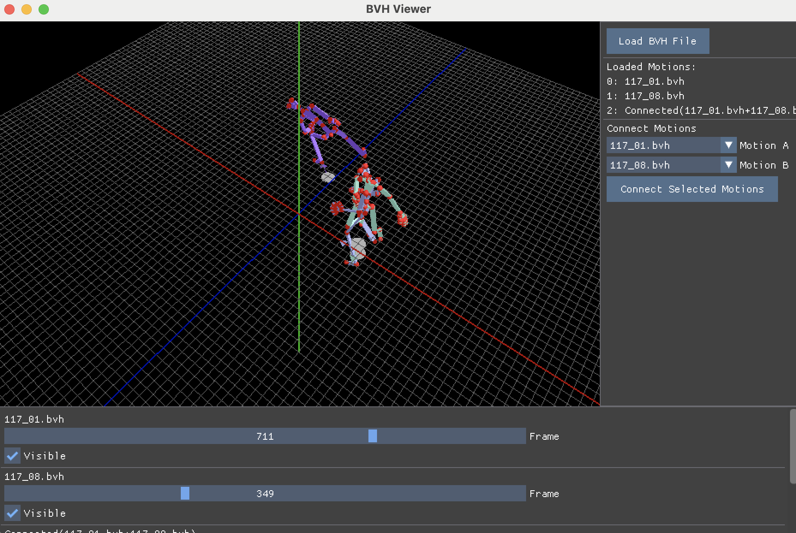

# BVH Parser with Motion Blending

## Installation & Usage

### 1️⃣ Clone the Repository
```bash
git clone https://github.com/your-repo.git
cd your-repo
```

### 2️⃣ Create BVH Folder & Add Files
```bash
mkdir bvh
mv your-file.bvh bvh/
```

### 3️⃣ Install Dependencies
```bash
pip install PyOpenGL PyOpenGL_accelerate PyGLM imgui[glfw] pygame
```

### 4️⃣ Run the Script
```bash
python main.py bvh/your-file1.bvh bvh/your-file2.bvh
```


## Project Structure

```plaintext
.
├── Main.py                # Entry point: initialization, main loop, etc.
├── bvh_controller.py      # Module for parsing BVH files & adding the virtual root.
├── virtual_transforms.py  # Transformation utilities: translation, rotation, forward kinetics, extracting yaw, etc.
├── Rendering.py           # OpenGL rendering routines (draw skeleton, mini-axis, global axes, etc.)
├── Events.py              # Event handling and camera control code.
├── UI.py                  # ImGui (or other UI) setup and widgets.
├── utils.py               # Additional helper functions (logging, error handling, configuration).
└── README.md              # Project documentation
```

## Sample Images

